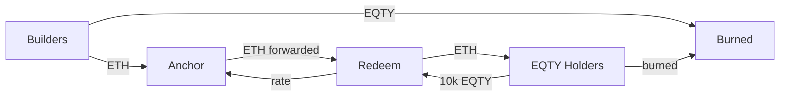

# EQTY Contracts

Smart contracts for the EQTY protocol on Base.

## Overview

The EQTY protocol creates a **Real Yield Loop** where:

1. **Builders/Services** pay fees via Anchor (ETH or EQTY)
2. **ETH accumulates** in the Redeem contract
3. **EQTY holders** can redeem tokens for ETH at a dynamic rate
4. **EQTY is burned** → deflationary tokenomics

This creates a self-sustaining ecosystem where EQTY value is backed by actual protocol revenue.

## Contracts

| Contract | Description |
|----------|-------------|
| **EQTY.sol** | ERC20 token with 500M cap, bridge-controlled minting, and burn functionality |
| **Anchor.sol** | Stateless anchoring contract - accepts ETH or EQTY for fee payment |
| **Redeem.sol** | Dynamic rate redemption of EQTY for ETH with anti-frontrunning protection |

### Canonical Public Events

Emit a canonical public event for a subject:

```solidity
bytes32 subjectId = keccak256("subject-123");
bytes32 eventType = keccak256("consume");
bytes memory data = abi.encode(uint256(1), msg.sender);

// Approve EQTY tokens for burning when using EQTY fees
eqtyToken.approve(anchorAddress, fee);

// Emit one canonical public event
anchor.emitPublicEvent(subjectId, eventType, data);
```

Notes:
- `source` is always `msg.sender`
- `eventType` is application-defined
- `data` is opaque to the anchor contract
- the same per-item payment model applies as `anchor(...)`
- callers can pay with ETH or EQTY, depending on Anchor configuration

## Architecture



## Payment Options (Anchor)

| Method | What Happens |
|--------|--------------|
| **Pay with ETH** | ETH forwarded to Redeem contract → distributed to EQTY holders |
| **Pay with EQTY** | EQTY burned directly (deflationary) |

The ETH price is automatically derived from `Redeem.currentRate()`.

Anchor data remains event-based:
- `Anchored` stores the key, value, sender, and timestamp
- `PublicEvent` stores canonical subject events with caller source and opaque payload

## Dynamic Exchange Rate

The exchange rate **self-adjusts** based on actual redemption activity:

```
r_next = r × clamp(p / r, 0.9, 1.1)
```

| Term | Meaning |
|------|---------|
| `r` | Current rate (ETH per 10k EQTY) |
| `p` | Actual ETH paid out |
| `0.9, 1.1` | Max ±10% change per transaction |

**How it works:**

- More ETH in contract than rate → Rate increases gradually
- Less ETH in contract than rate → Rate decreases gradually
- Rate naturally finds equilibrium based on protocol revenue

**Initial rate** is set by owner at deployment, then the system self-adjusts.

## Quick Start

### Prerequisites

Install [Foundry](https://book.getfoundry.sh/getting-started/installation):

```bash
curl -L https://foundry.paradigm.xyz | bash
foundryup
```

### Install Dependencies

```bash
forge install
npm install  # For OpenZeppelin contracts
```

### Build

```bash
forge build
```

### Test

```bash
# Run all tests (89 tests)
forge test

# Verbose output
forge test -vvv

# With gas report
forge test --gas-report

# Specific test file
forge test --match-path test/Anchor.t.sol
```

### Deploy

1. Copy `.env.example` to `.env` and configure:

```bash
cp .env.example .env
```

1. Deploy contracts in order:

```bash
# 1. Deploy EQTY token (if not already deployed)
forge script script/DeployEQTY.s.sol --rpc-url base-sepolia --broadcast --verify

# 2. Deploy Redeem (needs EQTY address)
forge script script/DeployRedeem.s.sol --rpc-url base-sepolia --broadcast --verify

# 3. Deploy Anchor (needs EQTY and Redeem addresses)
forge script script/DeployAnchor.s.sol --rpc-url base-sepolia --broadcast --verify
```

1. Post-deployment configuration:

```solidity
// Set initial exchange rate on Redeem contract
// Calculate based on: (EQTY price in USD) × 10,000 / (ETH price in USD)
redeemContract.setCurrentRate(0.012 ether); // Example: ~$30 worth at $2500 ETH

// Configure Anchor to point to Redeem
anchorContract.setRedeemContract(redeemAddress);
anchorContract.setEqtyToken(eqtyAddress);
anchorContract.setEqtyFee(100 ether); // 100 EQTY per anchor (DAO-configurable)

// Transfer ownership to DAO multisig
redeemContract.transferOwnership(daoMultisig);
anchorContract.transferOwnership(daoMultisig);
// New owner must call acceptOwnership()
```

## Project Structure

```
eqty-contracts/
├── src/                    # Contract source files
│   ├── Anchor.sol          # Anchoring with ETH/EQTY payment
│   ├── EQTY.sol            # ERC20 token
│   ├── Redeem.sol          # Dynamic rate redemption
│   ├── README.md           # Detailed Redeem docs
│   └── interfaces/
│       ├── IAnchor.sol     # Anchor interface
│       └── IRedeem.sol     # Redeem interface
├── test/                   # Foundry tests (89 tests)
│   ├── Anchor.t.sol
│   ├── EQTY.t.sol
│   └── Redeem.t.sol
├── script/                 # Deployment scripts
│   ├── DeployAnchor.s.sol
│   ├── DeployEQTY.s.sol
│   └── DeployRedeem.s.sol
├── foundry.toml            # Foundry configuration
└── package.json            # NPM dependencies
```

## Deployed Addresses

### Base Mainnet

| Contract | Address |
|----------|---------|
| EQTY Token | `0xC71F37D9bF4C5d1E7Fe4bCcB97e6f30B11b37D29` |
| Treasury | `0x2Bc456799F3Cf071B10CE7216269471e0A40381a` |
| Anchor | *Pending deployment* |
| Redeem | *Pending deployment* |

### Base Sepolia (Testnet)

| Contract | Address |
|----------|---------|
| Anchor | `0x7607af0cea78815c71bbea90110b2c218879354b` |

## DAO Configuration

All contracts use `Ownable2Step` for secure ownership transfer to DAO.

| Contract | Parameter | Description | Default |
|----------|-----------|-------------|---------|
| **Anchor** | `eqtyFee` | EQTY amount burned per anchor | 0 |
| **Anchor** | `redeemContract` | Address to receive ETH payments | - |
| **Redeem** | `currentRate` | ETH per 10k EQTY | Must be set |
| **Redeem** | `maxRateChangeBps` | Max rate change per redeem | 1000 (10%) |
| **Redeem** | `minRate` / `maxRate` | Safety bounds | 0 / max |
| **Redeem** | `foundationEthFeeBps` | Foundation ETH fee | 0 |
| **Redeem** | `foundationEqtyFeeBps` | Foundation EQTY fee | 0 |
| **Redeem** | `redeemAmount` | EQTY required per redeem | 10,000 |

## Design Philosophy

| Principle | Implementation |
|-----------|----------------|
| **Trustless** | No pause function, no admin backdoors |
| **Self-Correcting** | Rate adjusts automatically based on activity |
| **Deflationary** | EQTY burned on both Anchor and Redeem |
| **Real Yield** | ETH comes from actual protocol usage |
| **DAO-Governed** | Owners can be transferred to multisig/DAO |

## Environment Variables

```bash
# Required for deployment
PRIVATE_KEY=            # Deployer private key
BASE_MAINNET_RPC_URL=   # Base mainnet RPC
BASE_SEPOLIA_RPC_URL=   # Base Sepolia RPC
BASESCAN_API_KEY=       # For contract verification

# Contract addresses (after deployment)
EQTY_TOKEN_ADDRESS=
REDEEM_CONTRACT_ADDRESS=

# Configuration
BRIDGE_WALLET=          # For EQTY minting
FOUNDATION_WALLET=      # For fee collection
INITIAL_RATE=           # Optional: Override default rate
```

## Gas Optimization

All contracts are optimized for gas efficiency on Base L2:

- `via_ir` enabled for advanced optimizations
- 200 optimizer runs
- Minimal storage operations in Anchor (stateless design)
- Packed storage in Redeem (single slot for core config)
- Custom errors instead of require strings

## Security

| Contract | Security Features |
|----------|-------------------|
| **Anchor** | `Ownable2Step`, custom errors, max 100 anchors per tx |
| **EQTY** | Immutable bridge wallet, time-limited minting, 500M cap |
| **Redeem** | `Ownable2Step`, `ReentrancyGuard`, `SafeERC20`, slippage protection, rate bounds |

### Trust Model

- **No pause function** → Contracts cannot be stopped
- **No admin mint** → Supply is capped
- **Rate bounds** → Mathematical safety limits
- **Two-step ownership** → Secure DAO transfer

## License

MIT
## Security

For security concerns, please contact: security@eqty.network
